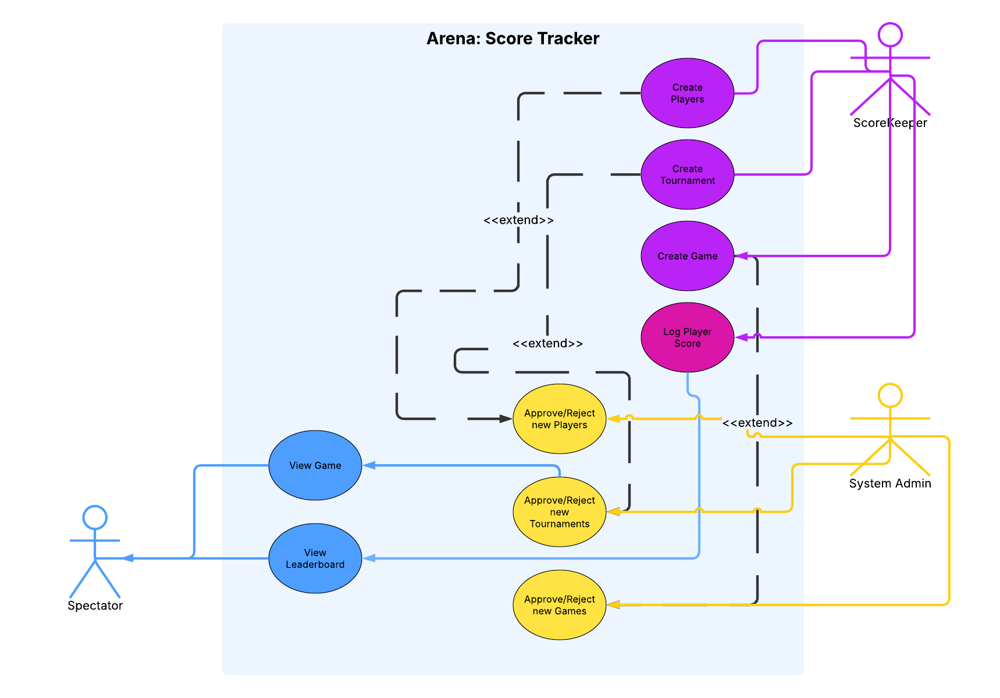
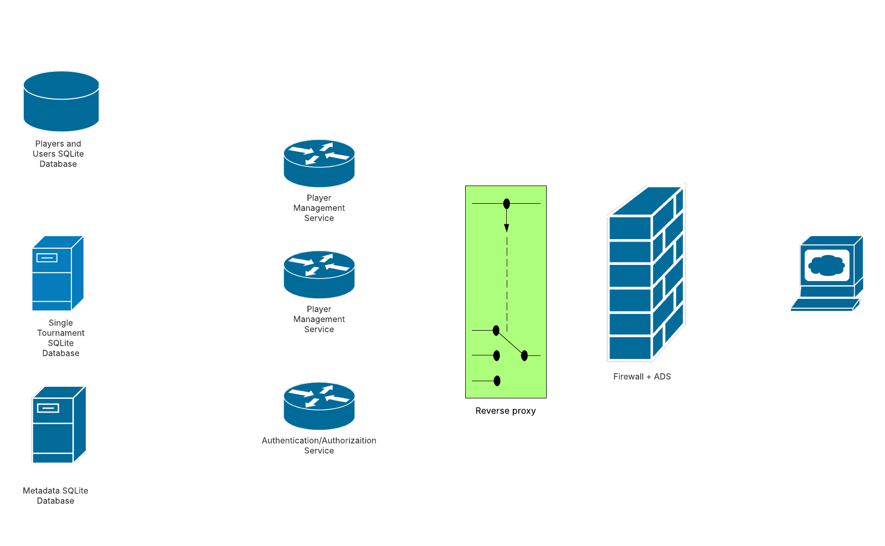
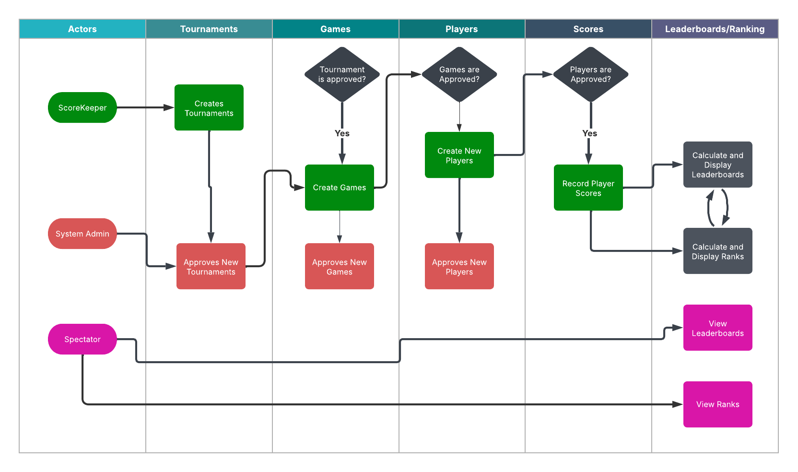
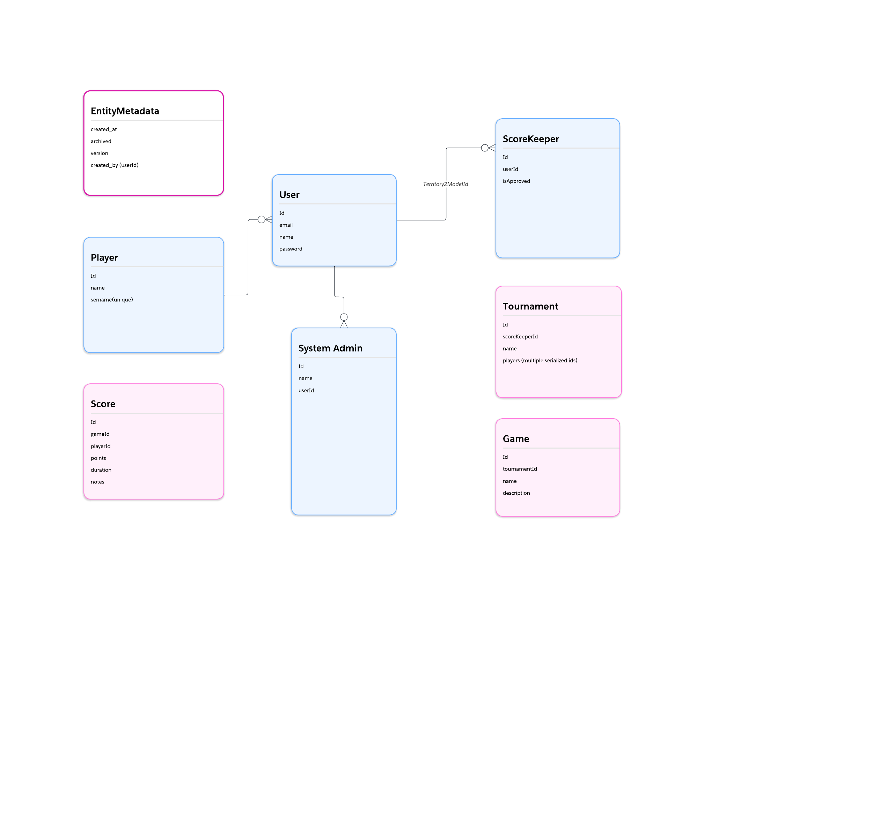
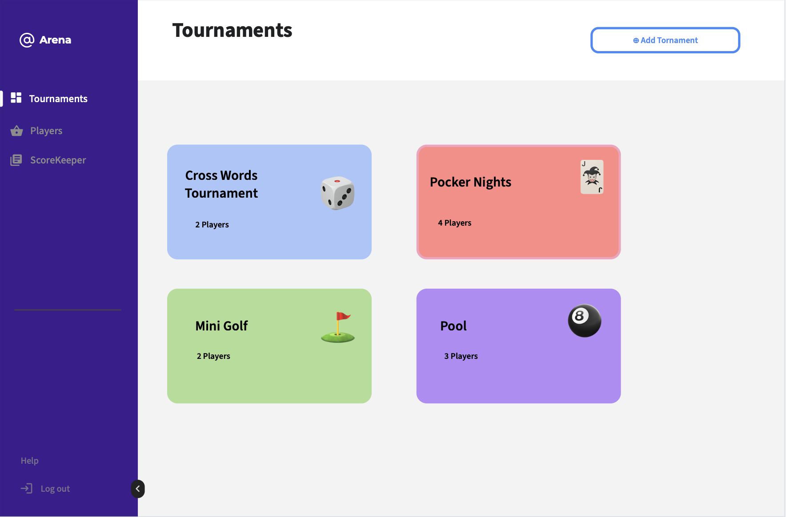
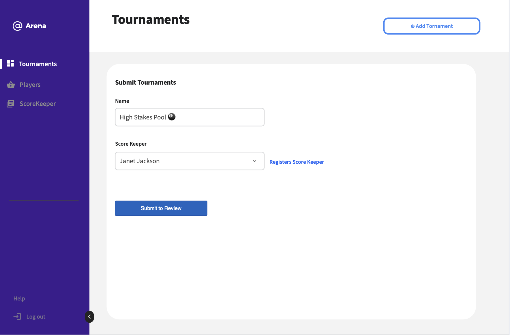
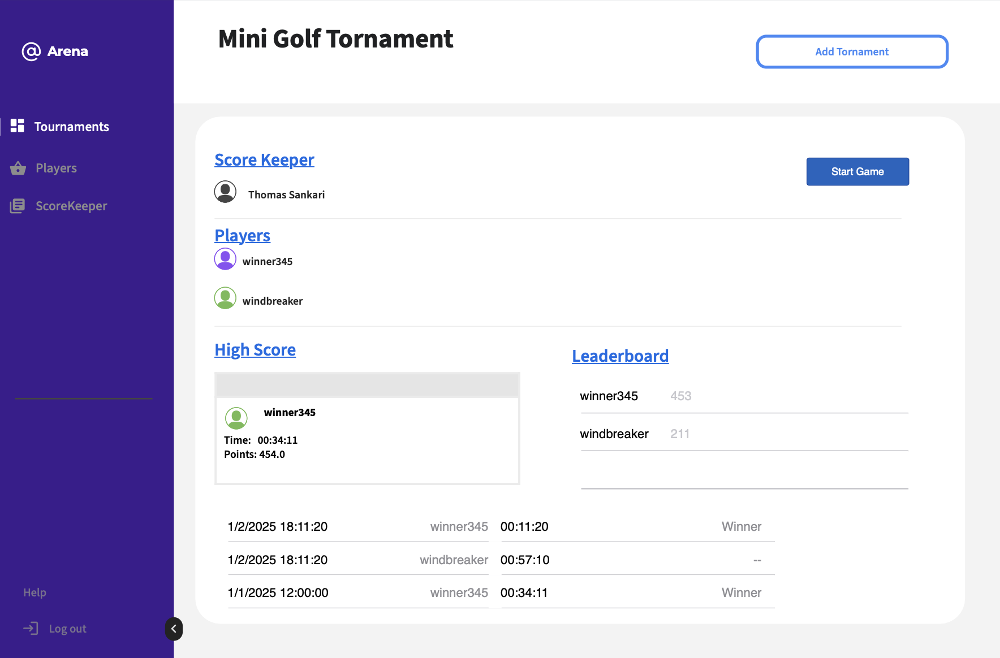
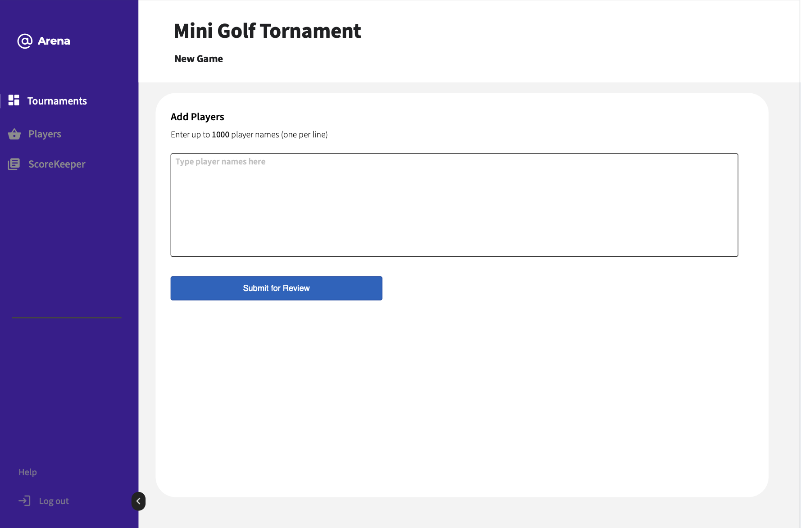
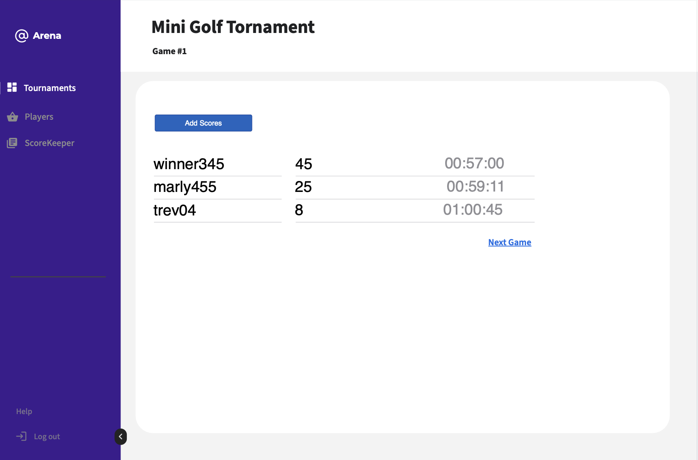
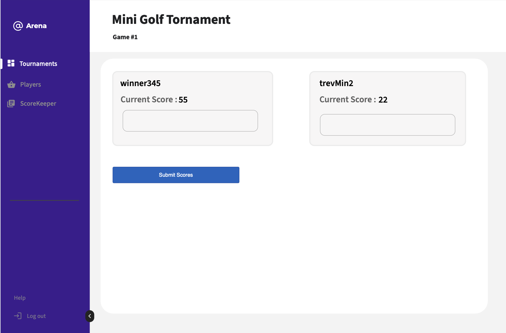

# Arena Score Tracking: Technical Specification

1. [**Introduction**](#introduction)
    - [1.1 Purpose](#11-purpose)
    - [1.2 Scope](#12-scope)
    - [1.3 Audience](#13-audience)
    - [1.4 Definitions, Acronyms, and Abbreviations](#14-definitions-acronyms-and-abbreviations)
    - [1.5 References](#15-references)
    - [1.6 Overview](#16-overview)

2. [**System Overview**](#system-overview)
    - [2.1 System Context](#21-system-context)
    - [2.2 Assumptions and Dependencies](#22-assumptions-and-dependencies)
    - [2.3 Constraints](#23-constraints)

3. [**Functional Requirements**](#functional-requirements)
    - [3.1 Feature Summary](#31-feature-summary)
    - [3.2 Use Cases / User Stories](#32-use-cases--user-stories)
    - [3.3 Functional Requirements ](#33-functional-requirements-fr-1-fr-2-)

4. [**Non-Functional Requirements**](#non-functional-requirements)
    - [4.1 Performance](#41-performance)
    - [4.2 Scalability](#42-scalability)
    - [4.3 Availability](#43-availability)
    - [4.4 Security](#44-security)
    - [4.5 Usability](#45-usability)
    - [4.6 Maintainability](#46-maintainability)

5. [**System Architecture**](#system-architecture)
    - [5.1 Architectural Overview](#51-architectural-overview)
    - [5.2 Component Diagram](#52-component-diagram)
    - [5.3 Data Flow Diagram](#53-data-flow-diagram)
    - [5.4 Technology Stack](#54-technology-stack)

6. [**Data Model**](#data-model)
    - [6.1 Entity-Relationship Diagram](#61-entity-relationship-diagram)
    - [6.2 Data Dictionary](#62-data-dictionary)

7. [**Interface Specifications**](#interface-specifications)
    - [7.1 User Interfaces](#71-user-interfaces)

---

# Introduction

## 1.1 Purpose

This specification aims to exhaustively define score tracking features on the *arena platform*, such as user flows, edge cases and implementation preferences such as persistence technologies and user experience considerations.

## 1.2 Scope

Score tracking feature and it's subset of feature are meant to cover capabilities that support points input, player registration, tournaments and tournament outcomes expressed as high scores, game play history and player/team ranking.

## 1.3 Audience

Developers, designers, reviews and other individuals that may be involved in the subsequent design, implementation and maintenance of this feature.

## 1.4 Definitions, Acronyms, and Abbreviations
Arena platform targets game play and `gaming` domain as such the specification may use the following domain specific definitions.

**1. Player**

An individual or entity participating in a game or competition. Each player may have unique identifiers such as a username, player ID, or profile.

**2. Score**

A numerical representation of a player's performance during a game or event. It may be calculated based on in-game actions, achievements, or metrics specific to the rules of the game.

**3. Duration**

The total time span over which a game session, round, or event occurs. Duration may be measured in seconds, minutes, or hours, and is often used to evaluate performance metrics like speed or efficiency.

**4. Tournament**

An organized series of games or matches where multiple players or teams compete under a defined set of rules. Tournaments typically progress through rounds and culminate in a final result or ranking.

**5. High Score / Record**

The highest score ever achieved by a player in a specific game, mode, or time period. Records may be global, regional, or session-based, and are often used to track historical bests.

**6. Rank**

A relative position of a player within a leaderboard or scoring hierarchy. Rank is typically determined by comparing scores, wins, or performance metrics against other players.

## 1.5 References

The following gaming and score tracking platforms were considered while preparing this specification

1. [KeepTheScore](https://keepthescore.com)
2. [RapidTables](https://www.rapidtables.com/tools/scoreboard.html)
3. [ScoreCount](https://scorecount.com)

## 1.6 Overview

This specification aims at defining how score tracking features will work within *arena* and how this will inform the technical implementation of these features. The document also aims at addressing edge cases, security considerations and deployment guides.

---

# System Overview

Arena's score tracker is an online multiplayer score-tracking platform that supports multiple concurrent users and tournaments spanning several user sessions. Score data is publicly available, reducing the need for strict security measures typically required for personally identifiable information, which the platform aims to collect only minimally. 

## 2.1 System Context

This technical specification is limited to a single-instance web application and does not consider other client types, such as mobile devices, as interfaces for interacting with the system.

## 2.2 Assumptions and Dependencies

**Assumptions**
- The capability of the platform are not subject to any immediate regulation from international bodies or laws from any known jurisdictions

**Dependencies**
- Server infrastructure
- Internet connectivity

## 2.3 Constraints

Concurrent usage will be subject to available hardware and operating system resources.

---

# Functional Requirements

## 3.1 Feature Summary

Arena's score tracking feature should support score tracking across user generated tournaments on the platform

## 3.2 Use Cases / User Stories

**System Actors**
1. Umpire/ScoreKeeper (user)
2. Spectator(non-user)
3. System Administrator

**Use-cases**

1. Umpire Capabilities

   - Register players
   - Register tournament
   - Start a new game
   - Enter player score
   
2. Spectator Capabilities
   - Watch Game
   - View Tournament Leaderboards
   - Share Game
   - Share Tournament
   
3. System Administrator Capabilities

   - Approve new tournament 
   - Approve new games
   - Approve players and player names
   - Remove tournaments
   - Remove games
   - Remove players

## 3.3 Functional Requirements

### FR-1
**Title:** User Authentication  
**Description:** The system shall allow users to log in using a username and password.  
**Rationale:** Ensures secure access to role-specific features.  
**Inputs:** Username, password  
**Outputs:** Authenticated session or error message  
**Dependencies:** User account exists, authentication service available  
**Acceptance Criteria:**
- Valid credentials grant access
- Invalid credentials return an error
- Role is assigned upon login (Scorekeeper, System Admin, Spectator)  
  **Priority:** Must-have

### FR-2
**Title:** Role-Based Dashboard Access  
**Description:** Users shall see a dashboard interface customized to their assigned role.  
**Rationale:** Provides appropriate features and limits unauthorized access.  
**Inputs:** Authenticated user session  
**Outputs:** Role-specific dashboard  
**Dependencies:** FR-1  
**Acceptance Criteria:**
- Scorekeeper sees score entry panel
- System Admin sees user management tools
- Spectators see leaderboard and tournament info  
  **Priority:** Must-have

### FR-3
**Title:** Submit Score  
**Description:** Scorekeepers shall be able to submit scores for players during or after a match.  
**Rationale:** Central functionality for tracking and recording game performance.  
**Inputs:** Player ID, score value, match ID, timestamp  
**Outputs:** Stored score record  
**Dependencies:** Player and match must exist  
**Acceptance Criteria:**
- Scores can be added without page reload
- Score saved is visible in live leaderboard  
  **Priority:** Must-have

### FR-4
**Title:** View Leaderboard  
**Description:** All users shall be able to view a real-time leaderboard of scores sorted by highest total or average.  
**Rationale:** Allows transparency and engagement for all roles, especially spectators.  
**Inputs:** Tournament ID or filter selection  
**Outputs:** Ranked list of players with scores  
**Dependencies:** FR-3  
**Acceptance Criteria:**
- Leaderboard updates within 5 seconds of new score submission
- Can filter by tournament, round, or date  
  **Priority:** Must-have

### FR-5
**Title:** Manage Tournaments  
**Description:** System Admins shall be able to create, edit, and close tournaments.  
**Rationale:** Admins need control over the structure and lifecycle of tournaments.  
**Inputs:** Tournament name, dates, participants  
**Outputs:** Tournament record in system  
**Dependencies:** Authenticated as System Admin  
**Acceptance Criteria:**
- Admins can create and edit tournaments
- Closed tournaments no longer accept new scores  
  **Priority:** Should-have

### FR-6
**Title:** Manage Users  
**Description:** System Admins shall be able to add, edit, assign roles to, or deactivate users.  
**Rationale:** Controls system access and role assignment.  
**Inputs:** User details (email, role, status)  
**Outputs:** Updated user records  
**Dependencies:** FR-1  
**Acceptance Criteria:**
- Admin can assign Scorekeeper or Spectator roles
- Deactivated users cannot log in  
  **Priority:** Should-have

### FR-7
**Title:** View Match History  
**Description:** Spectators and Scorekeepers shall be able to view historical scores for matches.  
**Rationale:** Enables review and analysis of past performance.  
**Inputs:** Player or match ID  
**Outputs:** List of previous scores with timestamps  
**Dependencies:** FR-3  
**Acceptance Criteria:**
- Display includes date, score, and opponent (if applicable)
- Can sort or filter by time period or player  
  **Priority:** Could-have

---

## Non-Functional Requirements

## 4.1 Performance
- **NFR-1:** The system shall load the leaderboard page within 2 seconds under normal network conditions.
- **NFR-2:** Score submission operations shall be processed within 1 second for 95% of requests.

## 4.2 Scalability
- **NFR-3:** The system shall support up to 10,000 concurrent users without degradation of performance.
- **NFR-4:** The architecture shall allow horizontal scaling of backend services and databases.

## 4.3 Availability
- **NFR-5:** The system shall be available 99.9% of the time on a monthly basis.
- **NFR-6:** Planned downtime for maintenance shall not exceed 2 hours per month and must be scheduled during off-peak hours.

## 4.4 Security
- **NFR-7:** All user data transmissions shall be encrypted using HTTPS/TLS.
- **NFR-8:** The system shall enforce role-based access control to protect administrative features.
- **NFR-9:** Login attempts shall be rate-limited to prevent brute-force attacks.

## 4.5 Usability
- **NFR-10:** The UI shall be usable by novice users with no training and follow WCAG 2.1 Level AA accessibility standards.
- **NFR-11:** Key actions (score submission, leaderboard view) shall be accessible within three clicks.

## 4.6 Maintainability
- **NFR-12:** The system shall be modular and support component-level updates without affecting unrelated features.
- **NFR-13:** Code and configuration shall be documented to allow new developers to onboard within 2 days.

----

# System Architecture (Monolith)

## 5.1 Architectural Overview

The Arena score tracking system is composed of the following core components within a monolithic architecture:

1. **User & Player Data Store (SQLite)**  
   A lightweight relational database storing player profiles and user account information. It ensures fast local access and simplified deployment using SQLite.

2. **Tournament Database (File-based SQLite)**  
   Each tournament instance maintains its own isolated file-based SQLite database. This design enables clean separation of tournament data and supports concurrent, independent event tracking.

3. **Platform Metadata Store (File-based)**  
   A dedicated file-based SQLite database that holds configuration metadata, system settings, and application-level state — allowing the system to manage multi-tournament contexts and platform-wide operations.

4. **Score Tracking Service Layer**  
   The core backend logic responsible for recording, validating, and processing score submissions. This layer enforces business rules and acts as the gateway to persistent storage.

5. **Reverse Proxy**  
   A reverse proxy (e.g., NGINX or similar) that routes client requests, manages SSL termination, and enforces routing rules between static assets, backend APIs, and rendered pages.

6. **Client Application (Server-Rendered Web UI)**  
   The user-facing interface, delivered as server-rendered HTML pages within the browser. It enables Scorekeepers, Admins, and Spectators to interact with the system via role-specific views.

## 5.3 Data Flow Diagram

## 5.4 Technology Stack

Arena Score Tracking platform is a Java Spring Boot Application with the following technical components:

- Java
- SQLite
- Thymeleaf
- JVM as runtime environment
- Spring MVC
- JUnit
- Spring Security

---

# Data Model

## 6.1 Entity-Relationship Diagram

## 6.2 Data Dictionary

**Tables**
- User
- Player
- ScoreKeeper
- System Admin
- Score
- Tournament
- Game

**Non-Table Entity**
- EntityMetadata

### User

| **Field Name** | **Data Type** | **Length** | **Format/Example**                                                          | **Description**   | **Allowed Values** | **Required?** |
|----------------|---------------|------------|-----------------------------------------------------------------------------|-------------------|--------------------|---------------|
| uuid           | UUID Text     | 255        | 6d1cf2ba-2a2c-47a9-b514-63229a1f7969                                        | Primary Key Field | UUID Text,Not Null | True          |
| name           | VARCHAR       | 255        | Maji Mzuri                                                                  | User name         | Text               | True          |
| email          | VARCHAR       | 255        | maji@mazuri.com                                                             | User email        | Email              | True          |
| password       | TEXT          | TEXT_SIZE  | $8XnOCf2XkUtVa$J.ZQXbFz2FCkDZt8XnOCf2XkUtVa3QZ8F9PbXP3ViMFl0XgksrUVzffgf... | Encoded Password  | Alphanumeric text  | True          |
|                |               |            |                                                                             |                   |                    |               |

### Player (Players are not users)

| **Field Name** | **Data Type** | **Length** | **Format/Example**                   | **Description**   | **Allowed Values** | **Required?** |
|----------------|---------------|------------|--------------------------------------|-------------------|--------------------|---------------|
| uuid           | UUID Text     | 255        | 6d1cf2ba-2a2c-47a9-b514-63229a1f7969 | Primary Key Field | UUID Text,Not Null | True          |
| username       | VARCHAR       | 255        | gamekiller1234                       | Username          | Text               | True          |

### ScoreKeeper (ScoreKeeper is a user)

| **Field Name** | **Data Type**  | **Length**  | **Format/Example**                   | **Description**     | **Allowed Values** | **Required?**    |
|----------------|----------------|-------------|--------------------------------------|---------------------|--------------------|------------------|
| uuid           | UUID Text      | 255         | 6d1cf2ba-2a2c-47a9-b514-63229a1f7969 | Primary Key Field   | UUID Text,Not Null | True             |
| userId         | UUID Text      | 255         | 6d1cf2ba-2a2c-47a9-b514-63229a1f7969 | Foreign Key Field   | UUID Text,Not Null | True             |
| verified       | Int(as 1 or 0) | Number Size | 1 (for true)                         | Verification status | Boolean (Int)      | True (Default 0) |
|                |                |             |                                      |                     |                    |                  |

### System Admin

| **Field Name** | **Data Type** | **Length** | **Format/Example**                   | **Description**   | **Allowed Values** | **Required?** |
|----------------|---------------|------------|--------------------------------------|-------------------|--------------------|---------------|
| uuid           | UUID Text     | 255        | 6d1cf2ba-2a2c-47a9-b514-63229a1f7969 | Primary Key Field | UUID Text,Not Null | True          |
| userId         | UUID Text     | 255        | 6d1cf2ba-2a2c-47a9-b514-63229a1f7969 | Foreign Key Field | UUID Text,Not Null | True          |
|                |               |            |                                      |                   |                    |               |

### Tournament

| **Field Name** | **Data Type** | **Length** | **Format/Example**                   | **Description**         | **Allowed Values** | **Required?** |
|----------------|---------------|------------|--------------------------------------|-------------------------|--------------------|---------------|
| uuid           | UUID Text     | 255        | 6d1cf2ba-2a2c-47a9-b514-63229a1f7969 | Primary Key Field       | UUID Text,Not Null | True          |
| scoreKeeperId  | UUID Text     | 255        | 6d1cf2ba-2a2c-47a9-b514-63229a1f7969 | Foreign Key Field       | UUID Text,Not Null | True          |
| name           | TEXT          | TEXT       | Cross-Word Puzzles Tournament        | Game name, user defined | Text               | True          |
| description    | TEXT          | TEXT       | Launch Date 5th Apri 2027            | user defined            | Text               | False         |
|                |               |            |                                      |                         |                    |               |

### Game

| **Field Name** | **Data Type** | **Length** | **Format/Example**                   | **Description**         | **Allowed Values** | **Required?**               |
|----------------|---------------|------------|--------------------------------------|-------------------------|--------------------|-----------------------------|
| uuid           | UUID Text     | 255        | 6d1cf2ba-2a2c-47a9-b514-63229a1f7969 | Primary Key Field       | UUID Text,Not Null | True                        |
| tournamentId   | UUID Text     | 255        | 6d1cf2ba-2a2c-47a9-b514-63229a1f7969 | Primary Key Field       | UUID Text,Not Null | True                        |
| name           | TEXT          | TEXT       | Cross-Word Puzzles Semi-Finals       | Game name, user defined | Text               | True                        |
| description    | TEXT          | TEXT       | James Vs Mark                        | Any kind of notes       | Text               | False, Default (empty text) |
|                |               |            |                                      |                         |                    |                             |

### Score

| **Field Name** | **Data Type**    | **Length** | **Format/Example**                   | **Description**               | **Allowed Values**    | **Required?**               |
|----------------|------------------|------------|--------------------------------------|-------------------------------|-----------------------|-----------------------------|
| uuid           | UUID Text        | 255        | 6d1cf2ba-2a2c-47a9-b514-63229a1f7969 | Primary Key Field             | UUID Text,Not Null    | True                        |
| gameId         | UUID Text        | 255        | 6d1cf2ba-2a2c-47a9-b514-63229a1f7969 | Foreign Key Field             | UUID Text,Not Null    | True                        |
| playerId       | UUID Text        | 255        | 6d1cf2ba-2a2c-47a9-b514-63229a1f7969 | Foreign Key Field             | UUID Text,Not Null    | True                        |
| points         | DOUBLE PRECISION | DOUBLE     | 0.5                                  | Player Score on a single game | Floating point number | False, Defaults (0)         |
| duration       | LONGTEXT         | LONG       | 6000                                 | Player Time in millis         | Number                | False, Defaults (0)         |
| notes          | TEXT             | TEXT       | Hard level in final round            | Any kind of notes             | Text                  | False, Default (empty text) |
|                |                  |            |                                      |                               |                       |                             |

### EntityMetadata (Applies to all tables)

| **Field Name**      | **Data Type**   | **Length** | **Format/Example**                   | **Description**                     | **Allowed Values** | **Required?**      |
|---------------------|-----------------|------------|--------------------------------------|-------------------------------------|--------------------|--------------------|
| uuid                | UUID Text       | 255        | 6d1cf2ba-2a2c-47a9-b514-63229a1f7969 | Primary Key Field                   | UUID Text,Not Null | True               |
| created_at          | TIMESTAMP TEXT  | 255        | 2025-11-04 11:22:44 UTC              | Text                                | Text               | True               |
| archived            | INT (as 0 or 1) | INT        | 1 (True)                             | INT                                 | 1 or 0             | False (Defaults 0) |
| version             | INT             |            | 4                                    | Migration and Serialization Version | 4                  | False (Defaults 1) |
| created_by (userId) | UUID Text       | 255        | 6d1cf2ba-2a2c-47a9-b514-63229a1f7969 | User ID                             | UUID Text,Not Null | True               |
|                     |                 |            |                                      |                                     |                    |                    |

---

# Interface Specifications

## 7.1 User Interfaces

### Tournaments Dashboard

### Tournaments Form

### Tournament Detailed

### New Game Form

### Game Dashboard

### record Scores Forms

---

